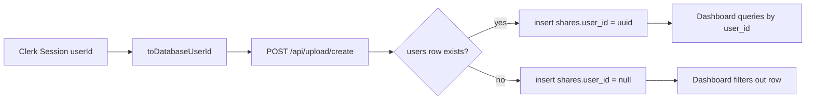

# Dashboard Ownership + Navigation Mitigation Plan (`pureshare`, `e2f4365`, 2026-02-11)

## 1. Executive Summary
- **Primary issue:** Shares are being created, but dashboard remains empty for authenticated users in some flows.
- **Secondary issue:** Dashboard navigation feels incomplete/non-smooth (especially section behavior and mobile parity).
- **Core root cause:** Auth identity (`Clerk userId`) is transformed to UUID, but the corresponding row in `users` may not exist; upload path then writes `shares.user_id = null`, while dashboard queries only read `shares.user_id = currentUserId`.
- **Outcome of this plan:** Fix ownership consistency first, then harden dashboard retrieval and upgrade UX/navigation behavior for `Overview`, `My Shares`, and `Settings`.

## 2. Evidence-Based Code Review

# Code Review – working tree (`e2f4365`)  (2026-02-11)

## Executive Summary
| Metric | Result |
|--------|--------|
| Overall Assessment | Needs Work |
| Security Score     | B |
| Maintainability    | B- |
| Test Coverage      | No targeted tests for ownership + dashboard navigation paths |

## 🔴 Critical Issues
| File:Line | Issue | Why it’s critical | Suggested Fix |
|-----------|-------|-------------------|---------------|
| `app/api/upload/create/route.ts:67` | Authenticated share creation silently falls back to `ownerUserId = null` when user row missing | Share is created but invisible to owner dashboards and owner-only APIs | Enforce authenticated user resolution (find/create DB user row) before insert; only anonymous sessions can produce `null` owner |
| `app/api/upload/create/route.ts:94` + `app/(dashboard)/dashboard/page.tsx:23` + `app/api/user/shares/route.ts:35` + `app/api/user/stats/route.ts:31` | Write path and read paths are inconsistent (`nullable owner` vs strict owner filter) | Core user journey breaks: create share -> dashboard shows none | Align ownership contract across create/read/update/delete |

## 🟡 Major Issues
| File:Line | Issue | Why it matters | Suggested Fix |
|-----------|-------|----------------|---------------|
| `app/(dashboard)/dashboard/page.tsx:44` | `select("*, files(*)")` on overview recent shares | Overfetches relation data not always needed; degrades response time with larger datasets | Replace with explicit projection of card fields; lazy-fetch file details only where needed |
| `app/api/user/shares/route.ts:34` | `select("*, files(*)")` on paginated list endpoint | Costly payload and query complexity for every page/filter | Use minimal list projection and optional details endpoint |
| `app/(dashboard)/dashboard/shares/page.tsx:27-32` | No `res.ok` handling and no visible error UI | API failures silently appear as empty state, perceived as “not working” | Add request-state machine (`loading/success/error`) with retry UI |
| `components/dashboard/sidebar.tsx:38` + `app/(dashboard)/layout.tsx:24` | Sidebar hidden under `md` and no alternative nav | Mobile users cannot reliably navigate dashboard sections | Add mobile nav (bottom tabs or drawer) with exact parity |

## 🟢 Minor Suggestions
- `components/dashboard/sidebar.tsx:73-75`: `cn(...)` wrapper adds no conditional class; simplify.
- Add route loading states: `app/(dashboard)/dashboard/loading.tsx`, `app/(dashboard)/dashboard/shares/loading.tsx`, `app/(dashboard)/dashboard/settings/loading.tsx`.
- Add `aria-current="page"` and stronger focus-visible states on nav links for accessibility.

## Positive Highlights
- ✅ Route structure is already cleanly separated by concern: `overview`, `shares`, `settings`.
- ✅ Active link logic is present and mostly correct (`pathname` checks).
- ✅ Existing DB indexes for user-centric share retrieval are already planned in migration (`supabase/migrations/20260211_add_video_mixed_share_support.sql:21-28`).

## Action Checklist
- [ ] Unify ownership model for authenticated flows.
- [ ] Remove list overfetch and reduce payload size.
- [ ] Add explicit error states/retry in dashboard pages.
- [ ] Deliver complete desktop+mobile dashboard navigation parity.
- [ ] Add tests for ownership visibility and section navigation.

---

## 3. Architecture + Flow Analysis (Architect View)

### 3.1 Current flow

### 3.2 Root cause for “share created but dashboard empty”
- Authenticated create route allows null owner fallback (`app/api/upload/create/route.ts:67-79`, `app/api/upload/create/route.ts:94`).
- Dashboard pages and APIs exclusively filter by `user_id` (`app/(dashboard)/dashboard/page.tsx:23`, `app/api/user/shares/route.ts:35`, `app/api/user/stats/route.ts:31`).
- Therefore the share exists in DB but is non-discoverable to the owner experience.

### 3.3 Additional UX confusion factor
- If list API fails, client silently renders empty (`app/(dashboard)/dashboard/shares/page.tsx:27-32`).
- This hides operational failures and looks identical to “no data”.

## 4. Data Strategy + DB Optimization Plan (Database-Optimizer View)

## 4.1 Ownership consistency strategy (required)
Choose one canonical strategy and enforce globally:

### Option A (recommended): provider-key mapping in `users`
- Add `users.clerk_user_id TEXT UNIQUE`.
- Resolve owner by `clerk_user_id` on every authenticated server request requiring ownership.
- If missing, create user row transactionally before share insert.
- Benefit: explicit identity mapping, easy auditing/debugging, robust FK integrity.

### Option B (fallback): deterministic UUID only
- Keep `toDatabaseUserId` mapping but auto-provision `users.id = dbUserId` when missing.
- Benefit: minimal schema changes.
- Risk: weaker traceability to external identity provider.

## 4.2 Retrieval query optimization
- Replace list projections:
  - `app/(dashboard)/dashboard/page.tsx:44`
  - `app/api/user/shares/route.ts:34`
- Recommended projection (list cards):
  - `id, share_link, title, created_at, expires_at, file_count, has_image, has_video, expiration_profile, password_hash`
- Keep `files(*)` only when opening share details or preview.

## 4.3 Index/utilization validation
Current migration already creates useful indexes (`supabase/migrations/20260211_add_video_mixed_share_support.sql:21-28`).

Validate with:
- `EXPLAIN (ANALYZE, BUFFERS)` for `user_id` recent list query.
- `EXPLAIN (ANALYZE, BUFFERS)` for active/expired counts.

Performance targets:
- `GET /api/user/shares` p95 < 120ms.
- `GET /api/user/stats` p95 < 80ms.
- Index scan usage > 95% for these paths.

## 5. UX/UI Integration Plan for Dashboard Options

## 5.1 Navigation information architecture
- **Overview** (`/dashboard`): high-level health + recent activity + quick actions.
- **My Shares** (`/dashboard/shares`): management workspace (filter, search, sort, paginate, update/delete).
- **Settings** (`/dashboard/settings`): account and defaults impacting future shares.

## 5.2 What to include in each option

### Overview (must-have)
- Stats cards: total, active, expired.
- Recent shares (latest N) with quick action links.
- “Create New Share” prominent CTA.
- Error surface if stats/recent fetch fails.

### My Shares (must-have)
- Filters: all/active/expired.
- Search by title/share link.
- Sort by created/expiry/date updated.
- Explicit states: loading, empty, error (with retry).
- Row/card actions: copy link, edit title, extend expiry, delete.

### Settings (must-have)
- Account summary.
- Share defaults for future uploads:
  - default expiration profile (`standard`/`video`)
  - default expiration option
  - optional “require password by default”
- Security notices and session/account links.

## 5.3 Smooth navigation behavior
- Keep desktop sidebar; add mobile equivalent nav.
- Preserve filter/search/sort in URL query params for browser back/forward continuity.
- Add route-level loading skeletons to avoid abrupt blank transitions.
- Add `aria-current` and keyboard focus states for robust accessibility.

## 6. Implementation Roadmap (Detailed)

### Phase 1: Data correctness first (blocker)
1. Introduce `resolveOrCreateDbUser` helper for authenticated ownership resolution.
2. Update `POST /api/upload/create` to require valid owner row for authenticated requests.
3. Backfill existing orphan shares where deterministic owner mapping is possible.
4. Add logging/telemetry for ownership assignment failures.

### Phase 2: Dashboard reliability
1. Update list/stat queries to minimal projections.
2. Add explicit API error handling in `My Shares` client page.
3. Add fallback error UI for overview stats/recent shares.
4. Ensure all owner-only operations use same ownership resolution contract.

### Phase 3: Navigation + interaction quality
1. Add mobile dashboard nav (same three destinations).
2. Add loading skeleton routes for dashboard sections.
3. Improve active nav semantics (`aria-current`) and focus states.
4. Persist filter state in URL for consistent back/forward navigation.

### Phase 4: Validation and rollout
1. Add tests:
   - authenticated create -> dashboard visibility
   - anonymous create -> not in user dashboard
   - nav parity desktop/mobile
   - my shares API error -> visible retry path
2. Run lint/type checks and manual UX pass.
3. Deploy behind small rollout if possible.

## 7. Acceptance Criteria (Testable)
1. Authenticated share creation never writes `shares.user_id = null`.
2. A share created by an authenticated user is visible in both Overview recent list and My Shares.
3. API error in My Shares displays error panel and retry button.
4. Overview/My Shares/Settings are reachable and usable on desktop and mobile.
5. Query payloads for list pages exclude `files(*)` unless explicitly needed.
6. URL state persists selected filter/sort on My Shares.

## 8. Risks and Mitigations
| Risk | Severity | Mitigation |
|------|----------|------------|
| Unknown `users` table constraints (legacy fields) | High | Inspect schema first; design user upsert to satisfy required columns |
| Incorrect backfill attribution for orphan shares | High | Only backfill deterministic matches; keep uncertain rows for manual handling |
| UI regressions while adding mobile nav | Medium | Component-level snapshots + E2E route checks |
| Performance regressions as data scales | Medium | Enforce projection + index plan checks before release |

## 9. Open Questions to Confirm Before Implementation
1. Should all authenticated uploads be strictly rejected if user linkage cannot be established (fail fast), or should we still allow anonymous fallback for signed-in users?
2. Do we want Overview to auto-refresh after upload via route refresh/event, or is navigation-triggered refresh enough for v1?
3. In Settings, which defaults are mandatory for this release: expiration profile only, or also password default + auto-delete preferences?

## 10. Recommended Execution Order
1. Implement Phase 1 (ownership correctness) immediately.
2. Implement Phase 2 (dashboard reliability) in same release.
3. Implement Phase 3 (navigation polish + mobile parity) next.
4. Close with Phase 4 validation gates before merge.

---

## 11. Addendum: Loading UX + Navigation Performance Review (`e2f4365`)

# Code Review – navigation/loading UX patchset (`e2f4365`)  (2026-02-11)

## Executive Summary
| Metric | Result |
|--------|--------|
| Overall Assessment | Good (post-fix) |
| Security Score     | A- |
| Maintainability    | B+ |
| Test Coverage      | No automated navigation latency tests yet |

## 🔴 Critical Issues (Observed Before Fix)
| File:Line | Issue | Why it’s critical | Suggested Fix |
|-----------|-------|-------------------|---------------|
| `components/ui/skeleton.tsx:7` | Skeleton used `bg-accent` (brand blue) for all loading states | Loading placeholders looked like hard UI blocks and caused visual confusion during navigation | Switch to neutral muted skeleton tone and keep accent for actual interactive controls only |
| `app/api/user/shares/route.ts:18` + `app/api/user/stats/route.ts:18` + `app/(dashboard)/dashboard/page.tsx:56` | Frequent `currentUser()` calls on hot paths introduced avoidable network latency | Route transitions felt delayed and users clicked multiple times | Remove `currentUser()` from high-frequency read paths; resolve by `auth().userId` only |

## 🟡 Major Issues (Observed Before Fix)
| File:Line | Issue | Why it matters | Suggested Fix |
|-----------|-------|----------------|---------------|
| `app/(dashboard)/dashboard/shares/page.tsx:24` | Full-grid skeleton re-shown on every filter switch | Creates perceived jank and UI “reset” despite existing data | Keep previous data visible, show lightweight "Updating..." state for refreshes |
| `components/dashboard/sidebar.tsx:70` + `components/layout/header.tsx:113` | Navigation links lacked explicit prefetch and immediate interaction feedback | Transitions feel sluggish especially in development and on lower-end devices | Add prefetch + active semantics + reduce blocking work on route load |
| `components/layout/header.tsx:72` | Hash-link clicks always routed as normal links | Same-page section navigation could feel slow and inconsistent | Handle same-page hash links client-side with smooth scroll + URL update |

## 🟢 Minor Suggestions
- Add real-user performance marks for route transitions (`navigationStart -> content interactive`) and track p50/p95.
- Add Playwright scenario to click `Overview -> My Shares -> Settings -> Overview` rapidly and assert single-click transition behavior.
- Add compact top route-progress indicator (optional) for stronger perceived responsiveness.

## Positive Highlights
- ✅ Ownership/data correctness fix is already in place; dashboard now has consistent user linkage.
- ✅ Query payloads are reduced for dashboard list surfaces.
- ✅ Error-state handling now exists for My Shares fetch failures.

## Action Checklist
- [x] Neutralize skeleton visual design.
- [x] Reduce hot-path auth/network overhead.
- [x] Improve filter refresh UX without full list re-skeletoning.
- [x] Improve nav responsiveness with prefetch and anchor handling.
- [ ] Add automated route-latency/perceived-performance tests.

### UX Research Interpretation (why users felt this was broken)
- Users interpret bright blue placeholders as loaded UI elements rather than loading placeholders.
- Full-list skeleton redraw on every tab/filter change mimics data loss and causes re-orientation cost.
- Delayed route transitions without explicit progress feedback trigger repeated clicking (trust degradation).

### UI Design Decision Update
- Loading visuals should be low-contrast and neutral; brand accent must indicate actionable state only.
- For repeated list interactions (filters/tabs), preserve context and avoid page-level visual reset.
- Navigation should prioritize predictable immediate feedback over ornamental animation.

### Mitigation Plan Extension (Performance + UX)
1. **Perceived-performance baseline**
   - Add simple timing logs around dashboard route switches and filter changes.
   - Define targets: sidebar/nav click response feedback < 100ms, dashboard route visible fallback < 200ms.
2. **Interaction model hardening**
   - Keep existing list visible on refresh.
   - Add non-blocking `Updating...` signal instead of full-grid placeholders.
3. **Navigation smoothness**
   - Keep links prefetched where possible.
   - Avoid unnecessary server-side identity round-trips on every page/API hit.
4. **Loading consistency**
   - Add route-level loading files for dashboard routes with neutral skeletons.
5. **Verification**
   - Manual: rapid click test across dashboard options + main navbar.
   - Automated: add E2E script for single-click route transitions under load.

### Acceptance Criteria for this addendum
1. Loading placeholders no longer use accent blue.
2. Filter switching in `My Shares` retains prior results while refreshing.
3. Dashboard navigation no longer requires repeated clicking under normal network conditions.
4. Main navbar same-page anchor links scroll immediately with one click.
5. Typecheck and targeted lint pass after changes.
